<div align="center" style="margin-top: 10%;">

<h1 align="center">Бот Mr. Эйч</h1>
</div>

<h2 align="center">Телеграм-бот компании Mr. Эйч для автоматизации процесса оформления документов, 
диалога с потенциальным клиентом и ведения документации </h2> 

# Руководство пользователя 

* Для поиска бота в телеграм введите: @mister_h_bot (https://t.me/mister_h_bot)
<p style="text-align: center;">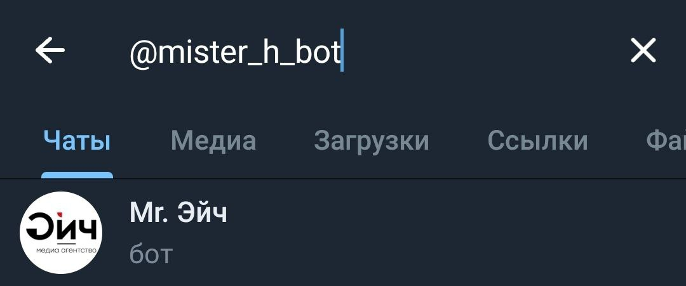</p>


#### Запустите бота нажав на start. Вас поприветствует телеграм-бот и предложит зарегистрироваться. Для регистрации вам нужно будет ввести такие данные как:
* Имя 
* Название компании
* Номер телефона
* Ваш веб-сайт

<div style="text-align: center;">

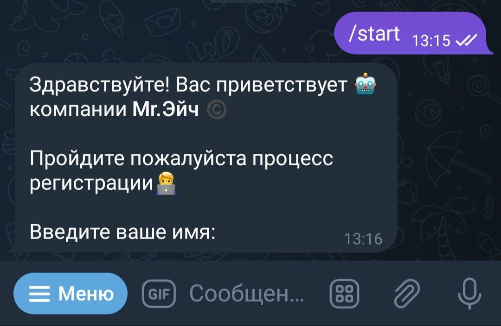
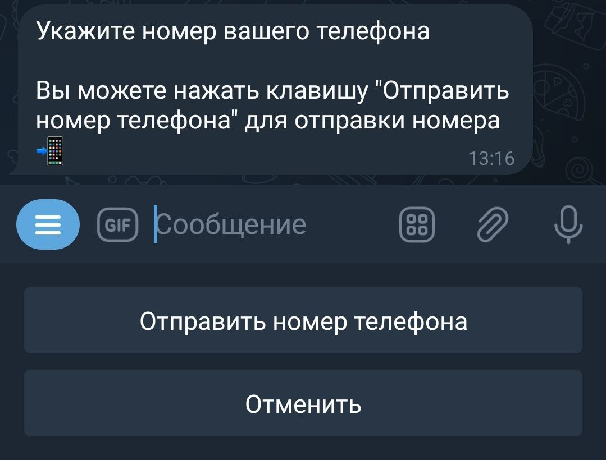
</div>


<div style="text-align: center;">
<p>
После процесса регистрации вы попадете в личный кабинет пользователя. 
Вы также сможете сразу связаться с оператором компании как в режиме "Постановки задачи" так и "Написав вручную"
После того, как оператор начнет диалог с вами придет соответствующее уведомление.
</p>
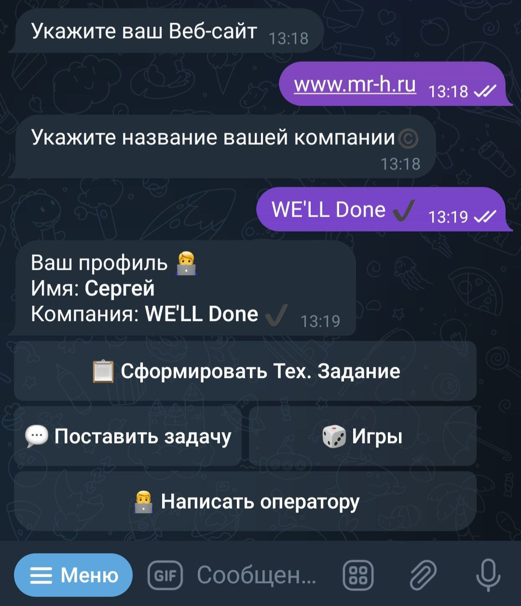
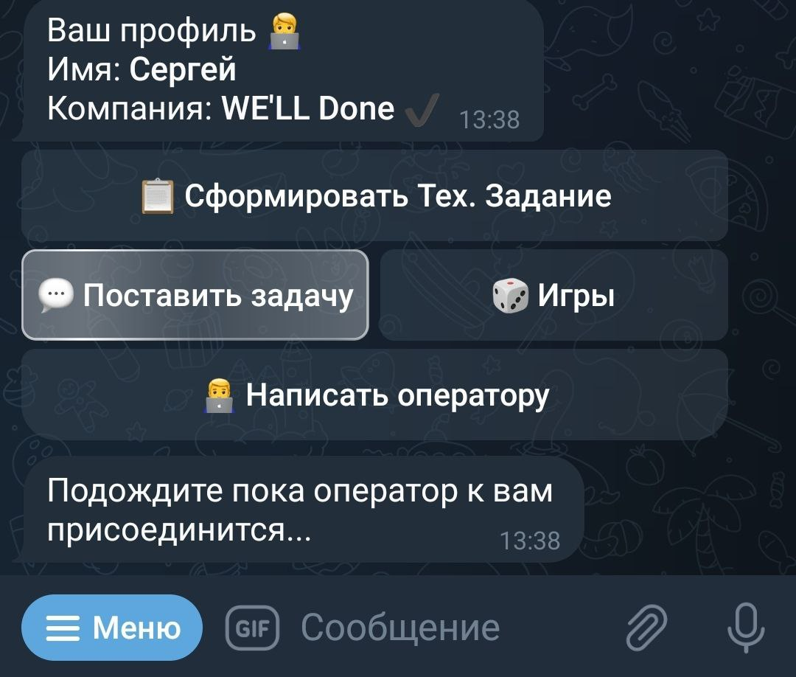
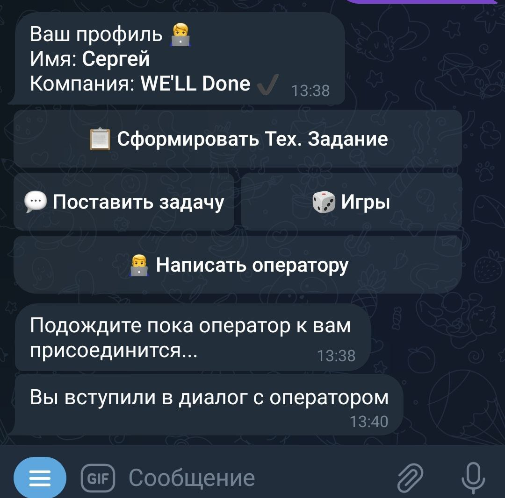
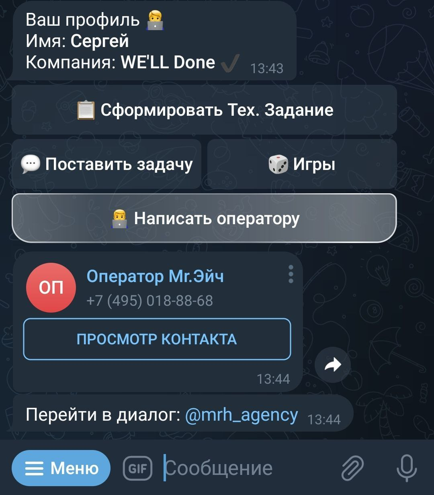
</div>


<div style="text-align: center;">
<p>
Также у вас есть возможность сформировать техническое задание для вашей компании. 
Для этого нужно нажать "Сформировать Тех. Задание", выбрать соответствующую категорию:
</p>
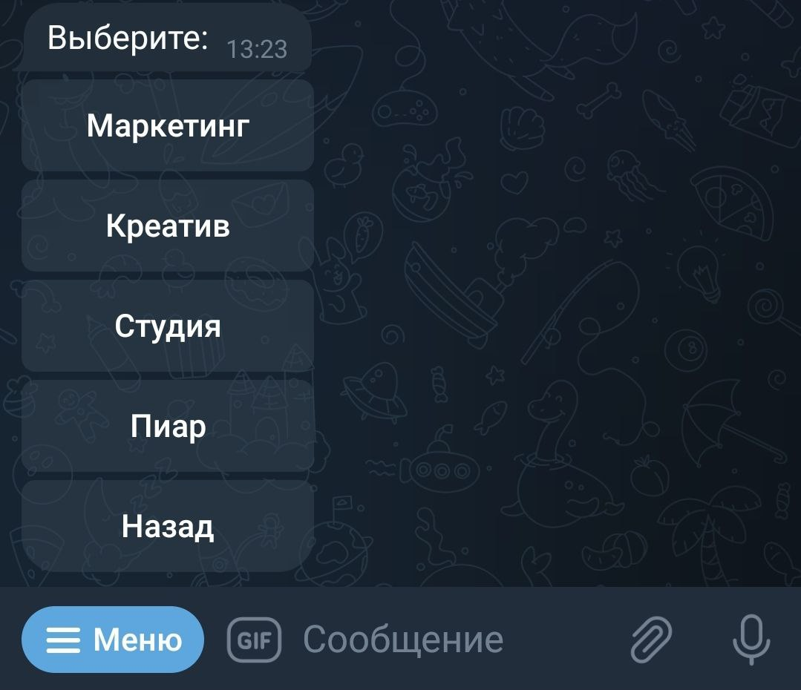
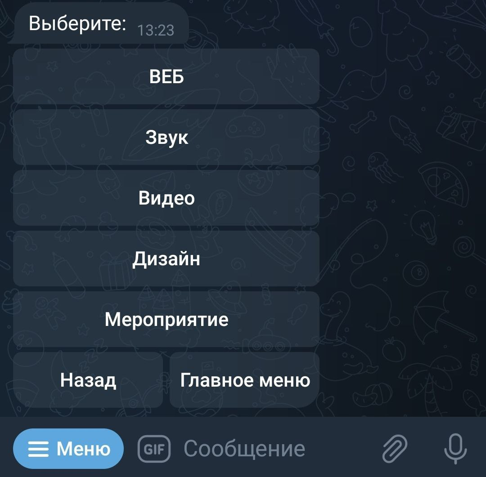

<p>
После того, как вы выбрали соответствующую категорию вам будет предоставлено меню из нескольких вопросов
</p>
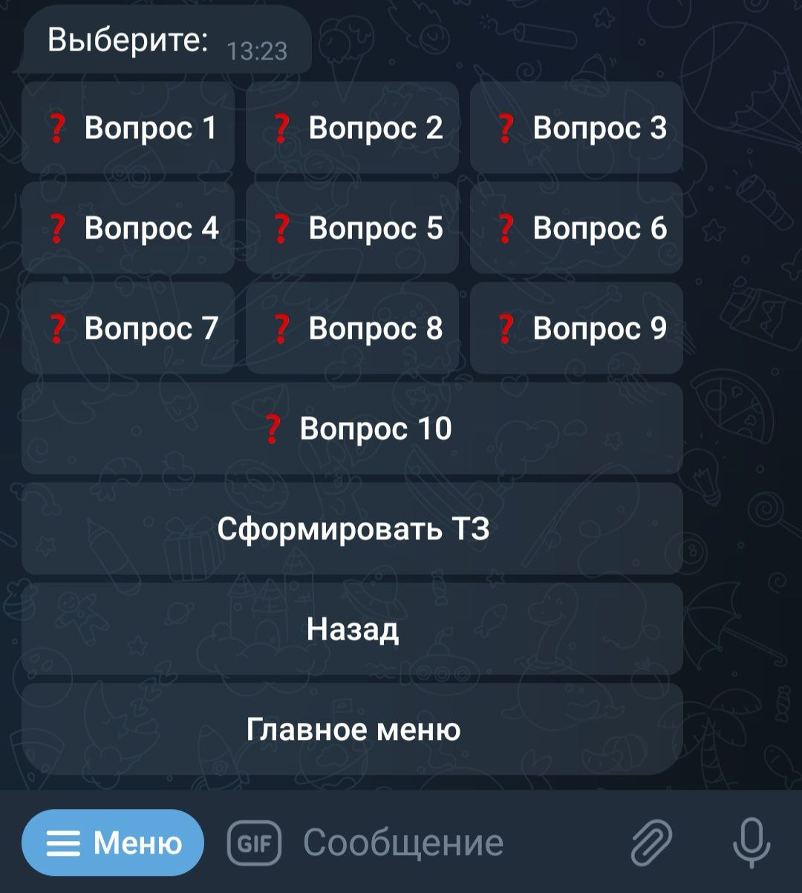
<p>Нажав на вопрос перед вами будет предоставлен выбор ответов, при этом вы сможете отправить свой личный вариант ответа
Внимание! Ответы принимаются только в том случае, если вы нажали "✅ Отправить ответ"
</p>
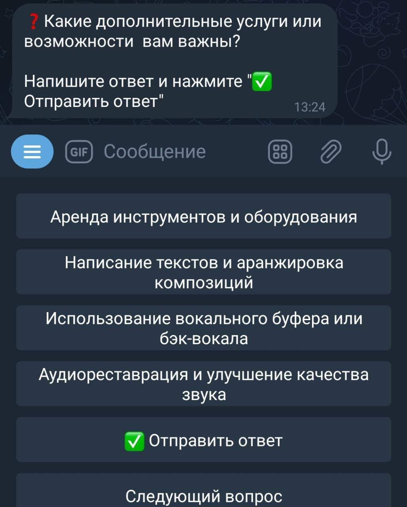
<p>Если вы все-же хотите пропустить определенный вопрос, просто нажмите - "Следующий вопрос"</p>
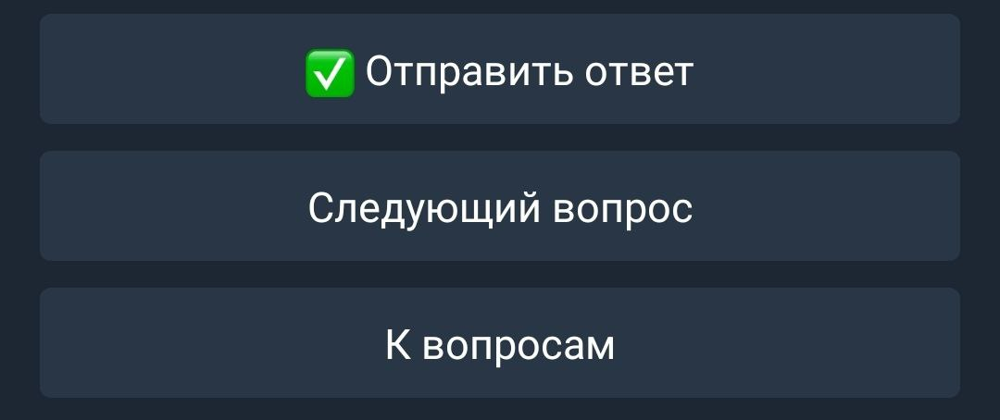
<p>Так выглядит меню после того как вы ответили на некоторые вопросы. Если вдруг вы захотите изменить ответ на
определенный вопрос, нажмите на него и выберите "Изменить ответ"</p>
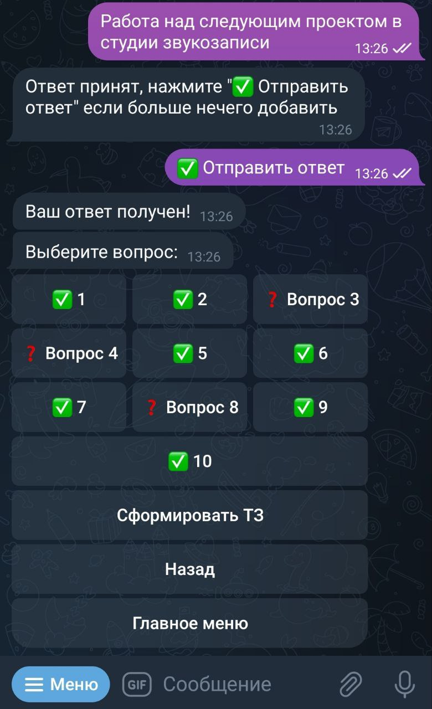
</div>

<div style="text-align: center;">
<p>После того, как вы ответили на вопросы нужно нажать в основном меню вопросов - "Сформировать ТЗ"
Немного подождав вы получите готовое техническое задание в формате Word.
</p>

</div>


### Помимо основного функционала телеграм-бота, мы имеем возможность предоставить вам развлекательный контент в виде простеньких и увлекающих игр
<div>
<p>Выберите в основном меню раздел игр и запустите одну из них 😊</p>


</div>


# Информация для разработчиков
## Данные, необходимые для работы сервиса
* TELEGRAM_BOT_API_TOKEN - токен, выданный BotFather для вашего бота
* OPERATOR_ID - telegram ID пользователя(оператора) для взаимодействия с ботом
* MySQL_HOST
* MySQL_USER
* MySQL_PASS
* MySQL_DB


# Установка приложения
## Telegram
- Создаём бота в BotFather (https://t.me/BotFather)
- Получение telegram ID для оператора

## Cерверная часть
1. [Установка и настройка nginx (Web-сервера)](#1)
2. [Настройка и приобретение LetsEncrypt SSL-сертификата](#2)
3. [Настройка Redis](#3)
4. [Настройка WEBHOOK](#4)
5. [Установка и настройка СУБД MySQL](#5)
6. [Настройка gunicorn](#6)
7. [Настройка supervisor](#7)


### Установка и настройка nginx (Web-сервера)<a id='1'></a>
```sudo apt-get install nginx```
Создаём файл конфигурации для проксирования запросов gunicorn'у
```sudo nano /etc/nginx/sites-enabled/telegram_bot_app```
Вставляем (+ указать доменное имя сервера)
```
server {
    server_name <YOUR_DOMAIN_NAME>;

    location / {
        proxy_pass http://127.0.0.1:8000/;
        proxy_set_header X-Forwarded-For $proxy_add_x_forwarded_for;
        proxy_set_header X-Forwarded-Proto $scheme;
        proxy_set_header X-Forwarded-Host $host;
        proxy_set_header X-Forwarded-Prefix /;
    }
```
Проверка конфигурационного файла
```sudo nginx -t```
Перезагрузка
```sudo nginx -s reload``` или ```sudo service nginx restart```

### Настройка LetsEncrypt SSL-сертификата<a id='2'></a>
- https://letsencrypt.org/getting-started/ - сайт для бесплатного получения SSL-сертификата
- https://certbot.eff.org/ - в этом разделе выбираем характеристики нашего сервера и получаем инструкцию для установки SSL-сертификата
- https://certbot.eff.org/instructions?ws=nginx&os=ubuntufocal - пример для nginx + ubuntu


```sudo apt install snapd```


Производим настройку сертификата:
```sudo certbot --nginx```

Просмотр созданных сертификатов
```
sudo su
ls -l /etc/letsencrypt/live/website.com
```
Автоматическое обновление сертификатов:
```certbot renew --dry-run```

После установки сертификата файл /etc/nginx/sites-enabled/telegram_bot_app выглядит так:
```
server {
    server_name website.com;
    location / {
        proxy_pass http://127.0.0.1:8000/;
        proxy_set_header X-Forwarded-For $proxy_add_x_forwarded_for;
        proxy_set_header X-Forwarded-Proto $scheme;
        proxy_set_header X-Forwarded-Host $host;
        proxy_set_header X-Forwarded-Prefix /;
    }
    listen 443 ssl; # managed by Certbot
    ssl_certificate /etc/letsencrypt/live/website.com/fullchain.pem; # managed by Certbot
    ssl_certificate_key /etc/letsencrypt/live/website.com/privkey.pem; # managed by Certbot
    include /etc/letsencrypt/options-ssl-nginx.conf; # managed by Certbot
    ssl_dhparam /etc/letsencrypt/ssl-dhparams.pem; # managed by Certbot
}
server {
    if ($host = website.com) {
        return 301 https://$host$request_uri;
    } # managed by Certbot


    listen 80;
    server_name website.com;
    return 404; # managed by Certbot
}
```

### Настройка Redis<a id='3'></a>
Устанавливаем Redis (для быстрой обработки запросов и хранения различных данных в памяти при потоковой передачи в режиме реального времени)

Установка
> sudo apt-get install redis

Если нужно 
```
sudo apt install lsb-release
sudo snap install redis
sudo snap install redis-configurable
```
Найти файл
```find /* <filename>```

```
sudo systemctl start redis
```
If FAILURE: 
```
sudo chown -R redis:redis /var/log/redis
sudo chmod -R u+rwX,g+rwX,u+rx /var/log/redis
sudo chmod +r /etc/redis/redis.conf
```

Запуск
> redis-cli

Пароль настраивается непосредственно в файле конфигурации Redis - /etc/redis/redis.conf.

### Настройка WEBHOOK<a id='4'></a>
Задать адрес для webhook
```
curl https://api.telegram.org/bot<YOUR_TOKEN>/setWebhook?url=https://<YOUR_ip_address>
```
Проверка WEBHOOK
```
curl https://api.telegram.org/bot<YOUR_TOKEN>/getWebhookInfo
```
Удалить WEBHOOK
```
curl https://api.telegram.org/bot<YOUR_TOKEN>/setWebhook
```

### Установка и настройка СУБД MySQL<a id='5'></a>
Дополнительная инструкция - https://www.digitalocean.com/community/tutorials/how-to-install-mysql-on-ubuntu-20-04-ru
> sudo apt update
> sudo apt install mysql-server
> sudo mysql_secure_installation

Если Failed! Error при установке:
> sudo killall -9 mysql_secure_installation

Запустите клиент mysql:
> sudo mysql

Запустите следующий SQL-запрос (Заменив PASSWORD на ваш пароль):
> ALTER USER 'root'@'localhost' IDENTIFIED WITH mysql_native_password BY 'PASSWORD';
>
> exit

Затем пройти настройку защиты, выполнив следующую команду:
```sudo mysql_secure_installation```

Для использования пароля для подключения к MySQL в качестве root пользователя необходимо изменить метод аутентификации с auth_socket на другой плагин, например caching_sha2_password или mysql_native_password.
> mysql -u root -p
> 
> ALTER USER 'root'@'localhost' IDENTIFIED WITH caching_sha2_password BY 'PASSWORD';
> 
> FLUSH PRIVILEGES;
>
> exit

Войти снова
> mysql -u root -p

Создайте нового пользователя и придумайте для него надежный пароль:

> CREATE USER 'username'@'localhost' IDENTIFIED BY 'PASSWORD';

> GRANT ALL PRIVILEGES ON *.* TO 'username'@'localhost' WITH GRANT OPTION;

Перезапуск MySQL:
> systemctl restart mysql.service

> systemctl status mysql.service

В качестве дополнительной проверки вы можете попробовать подключиться к базе данных с помощью
инструмента mysqladmin, который позволяет запускать команды администрирования. Например, эта команда
позволяет подключиться к MySQL в качестве пользователя root (-u root), запросить пароль (-p) и обеспечить возврат версии.
> sudo mysqladmin -p -u root version

### Настройка gunicorn (прокси-сервер WSGI)<a id='6'></a>
- В файле [gunicorn_config.py](gunicorn_config.py) меняем стандартные данные на собственные (В зависимости от расположения путей и настроек сервера)
- В bash-скрипте [start_gunicorn.sh](bin%2Fstart_gunicorn.sh) также меняем стандартные данные на собственные (В зависимости от расположения путей и настроек сервера)
Добавляем права на выполнение bash-скрипта:
> chmod +x start_gunicorn.sh

Просмотр логов gunicorn:
```/var/log/gunicorn/```

### Настройка supervisor<a id='7'></a>
Установка

> sudo apt supervisor

> sudo nano /etc/supervisor/conf.d/telegram_bot.conf

Вставляем:
```
[program:gunicorn]
command=/home/user/code/bot/telegram_bot/bin/start_gunicorn.sh
user=user
process_name=%(program_name)s
numproc=1
autostart=1
autorestart=1
redirect_stderr=true
```
Запуск сервиса:
```sudo service supervisor start```

Логи:
```cd /var/log/supervisor/```

[](https://git.io/typing-svg)
